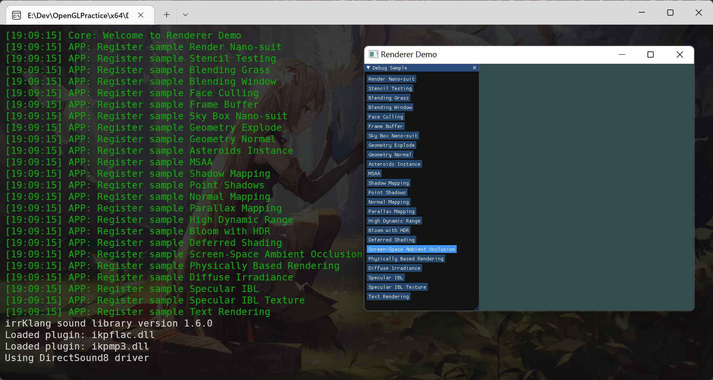
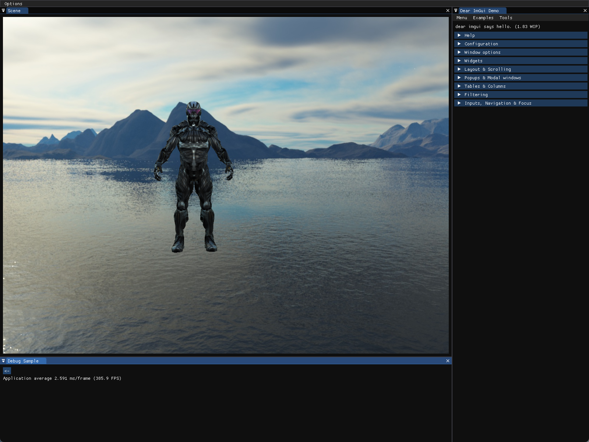
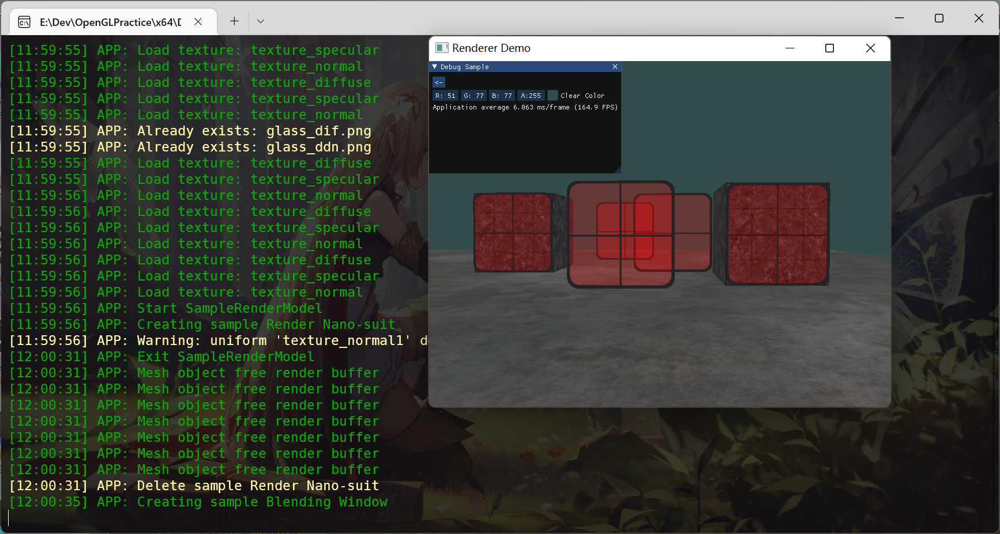
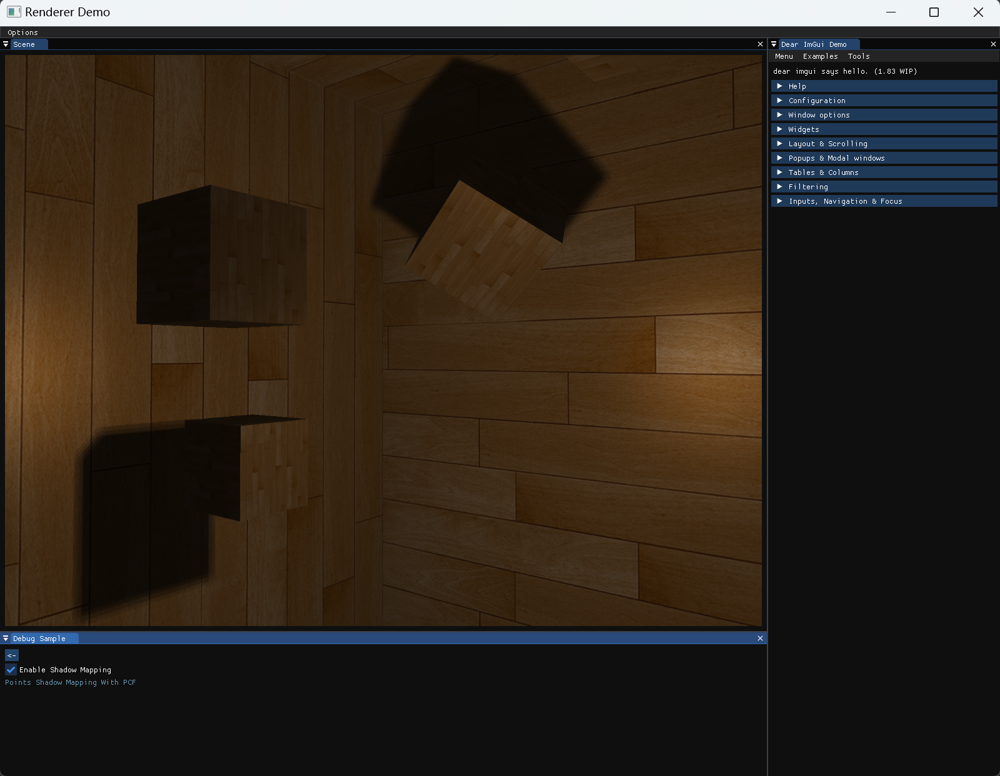
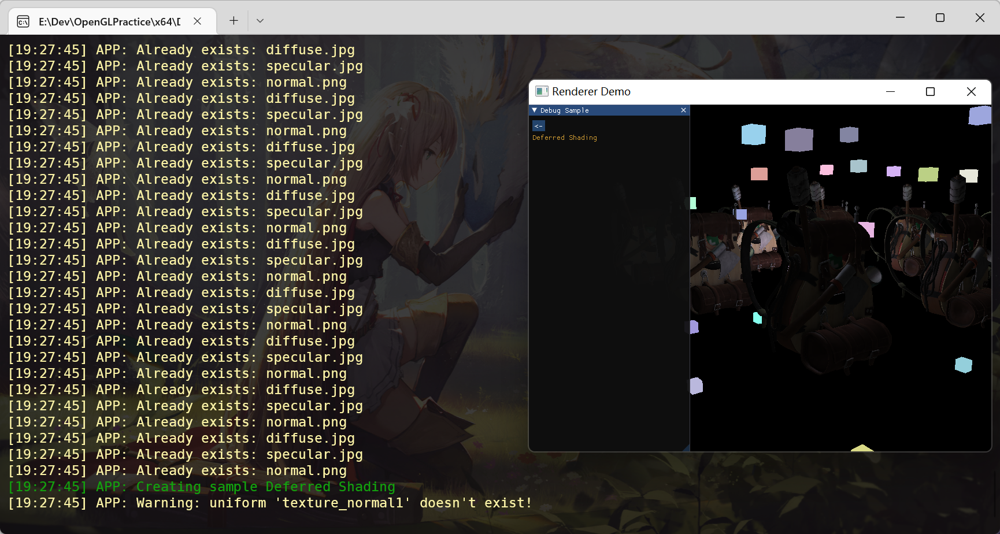
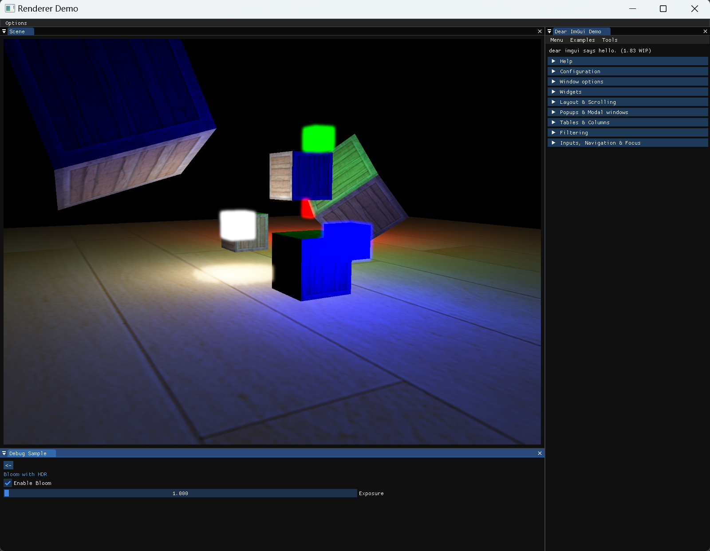
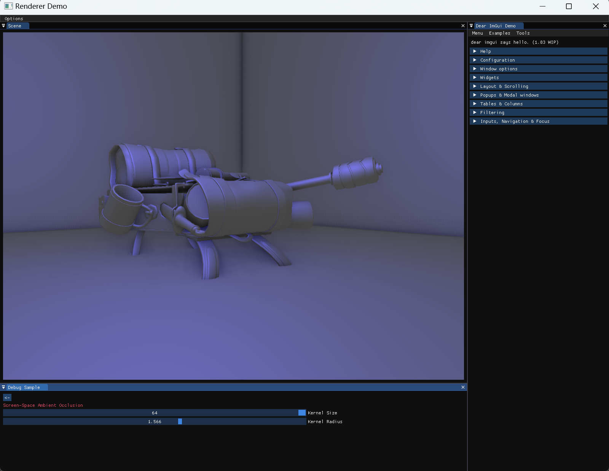
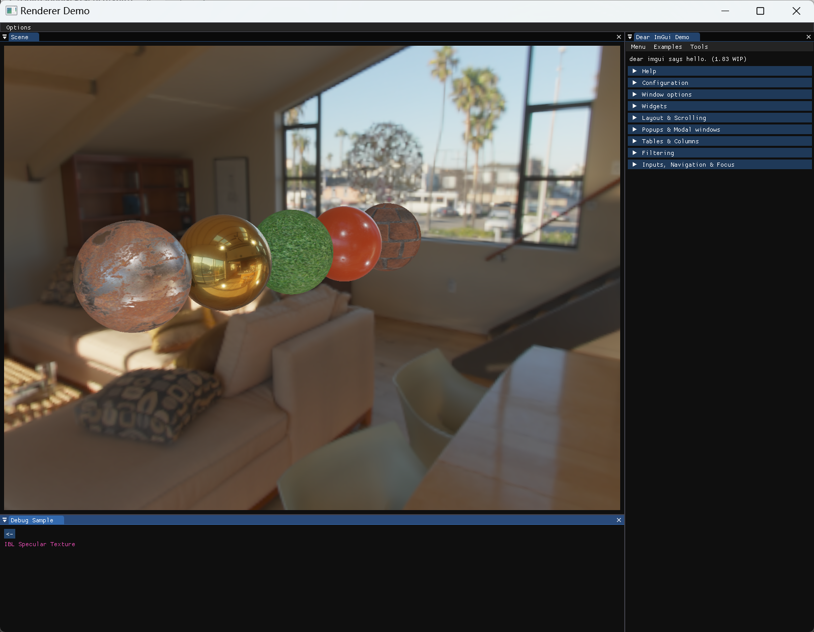

# RendererDemo
- A Renderer Demo Based On OpenGL
- Personal Practice
# Preview
- RenderDemo Preview

- Model in Sky Box

- Blending Rendering

- Shadow Mapping

- Deferred Shading

- Bloom With High Dynamic Range

- Screen-Space Ambient Occlusion(SSAO)

- Physically Based Rendering
