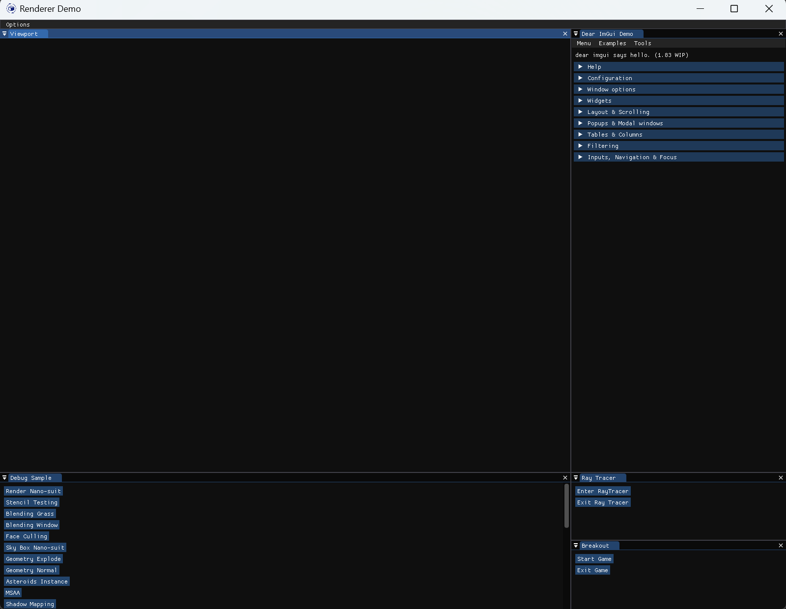
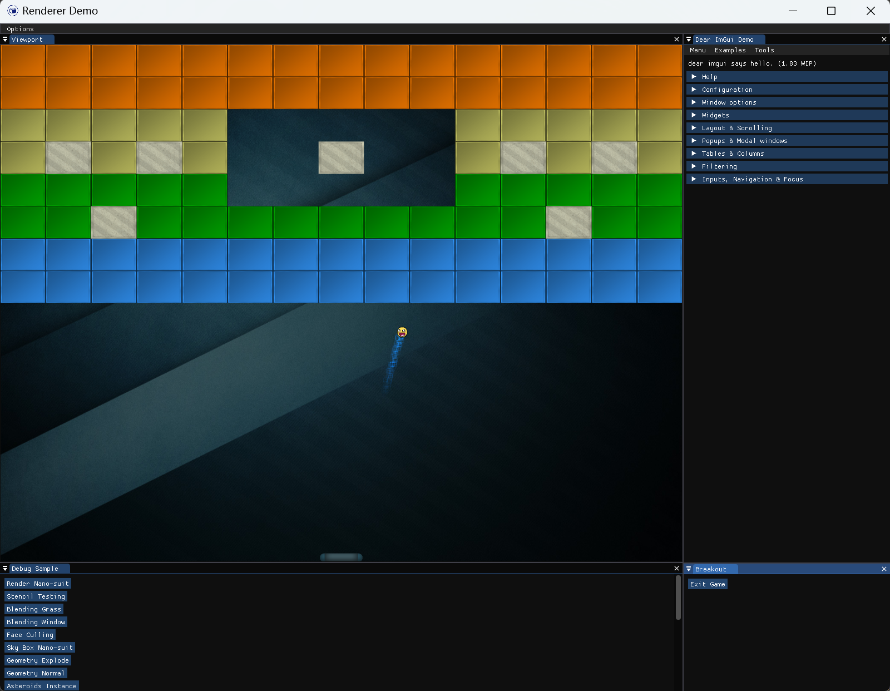
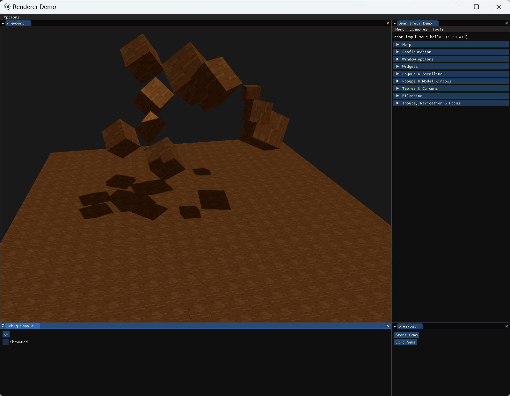
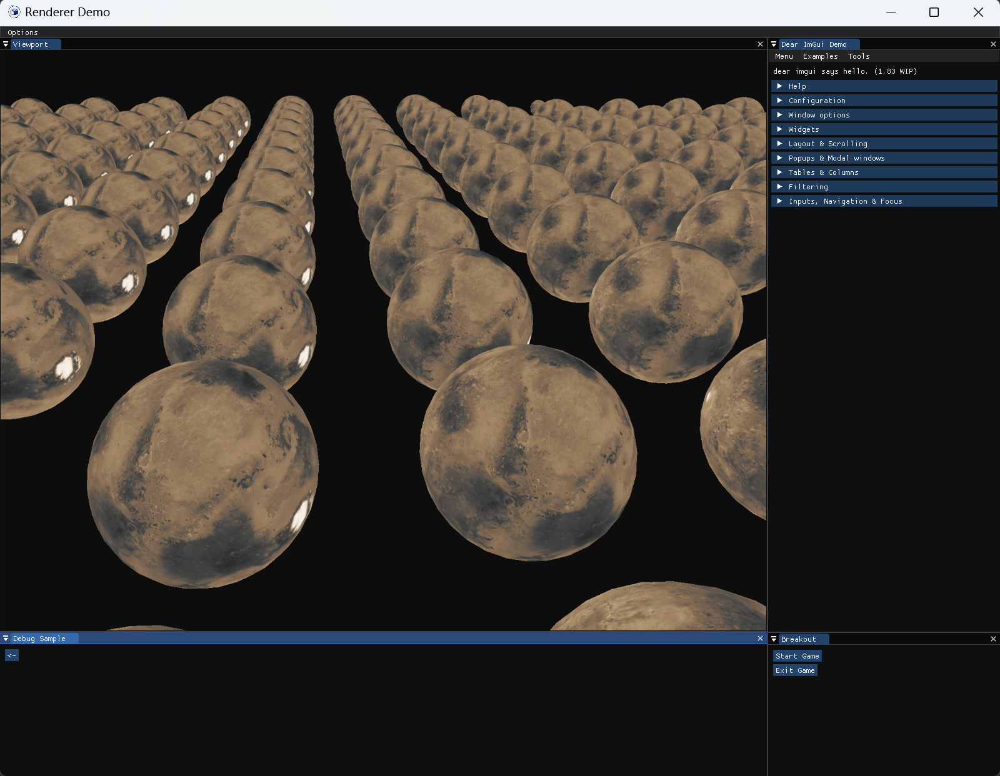
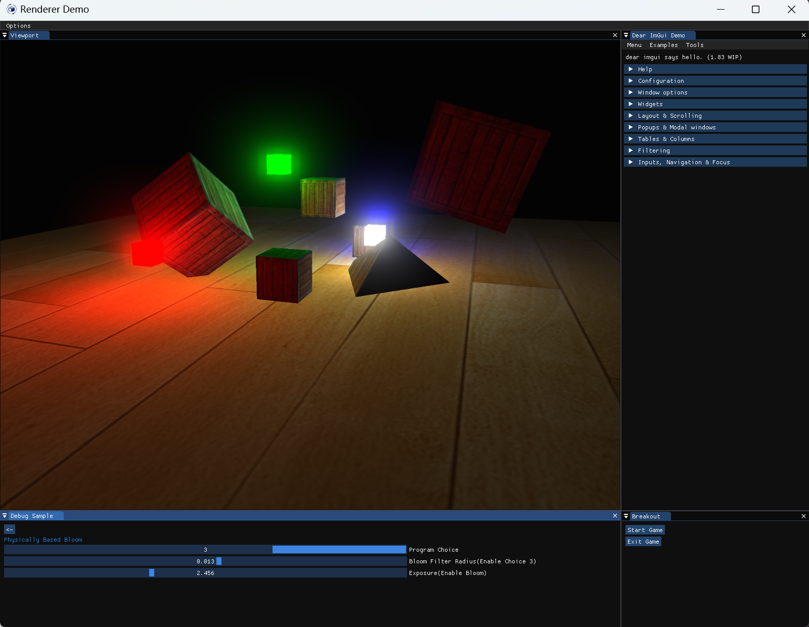
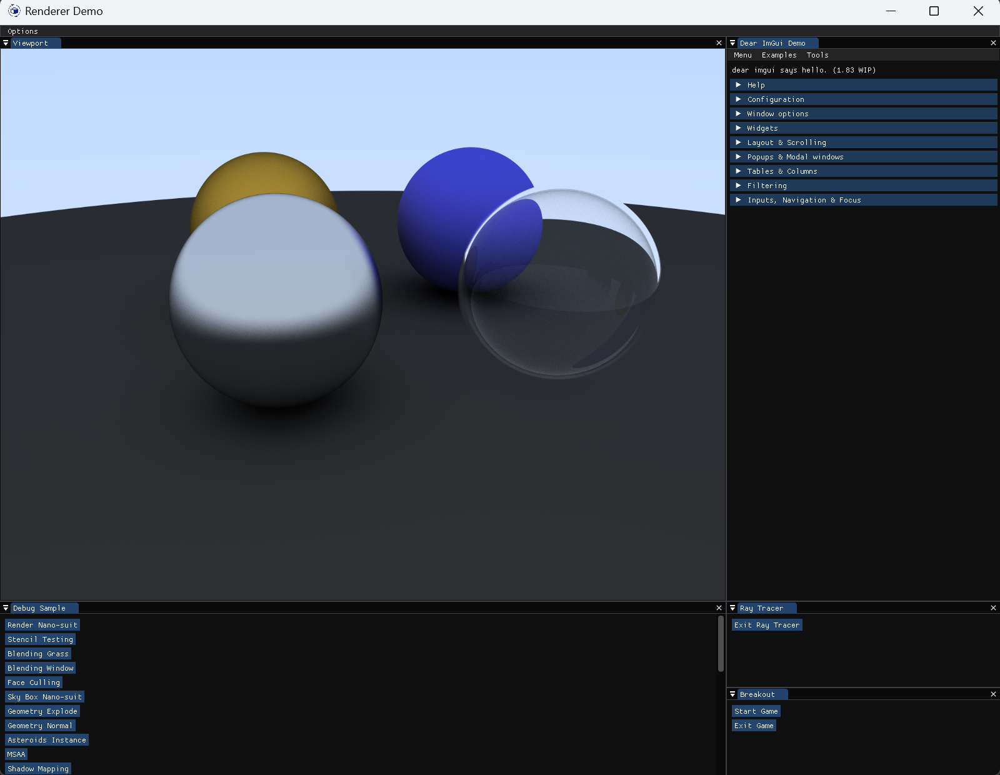

# RendererDemo
- A Renderer Demo Based On OpenGL API
- Personal Practice
- References
    - Learn OpenGL: https://learnopengl.com/
    - GPU-Path-Tracer: https://github.com/diharaw/gpu-path-tracer
# Preview
## Rasterization
- RenderDemo Preview

- Model in Sky Box

- Blending Rendering

- Shadow Mapping

- Deferred Shading

- Bloom With High Dynamic Range

- Screen-Space Ambient Occlusion(SSAO)

- Physically Based Rendering

- 2D Game Breakout

- Cascaded Shadow Mapping

- Frustum Culling via BVH

- Rendering Terrain via Tessellation Shader

- Physically Based Bloom

## Ray Tracing
- Path Tracing
